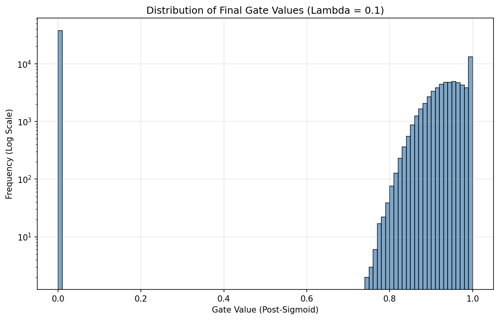

# Self-Pruning Neural Network

## Description
This project introduces a self-pruning neural network designed to dynamically identify and remove less critical connections during the training phase. By attaching a learnable gate parameter to each weight and employing an L1 sparsity regularization loss, the network actively penalizes excessive active connections. This built-in mechanism allows the model to adapt its architecture on the fly, resulting in a sparse network that balances classification accuracy with memory and computational efficiency without requiring a secondary post-training pruning step.

## Features
- **Dynamic Architecture Adaptation**: Introduces a custom `PrunableLinear` module that learns its own topology on the fly via trainable gate parameters.
- **Embedded Sparsity Regularization**: Integrates an L1 penalty directly into the training loop, forcing non-essential weights to exactly zero without any post-processing steps.
- **CIFAR-10 Benchmarking**: Demonstrates the pruning approach on standard image data, building a robust feed-forward model from the ground up.
- **Trade-off Evaluation**: Includes built-in analysis tools to actively measure and compare network sparsity levels against test accuracy for different regularization strengths ($\lambda$).

## Results

| Lambda | Accuracy (%) | Sparsity (%) |
|--------|--------------|--------------|
| 0.001  | 54.12        | 4.31         |
| 0.01   | 54.33        | 23.53        |
| 0.1    | 54.17        | 37.88        |


### Final Gate Values Distribution



## Project Structure
- `model.py`: Contains the definition of the custom `PrunableLinear` layer and the `SelfPruningNetwork` architecture, including methods for calculating the sparsity loss and sparsity level.
- `train.py`: Handles the dataset loading (CIFAR-10), the custom training loop integrating the L1 penalty, and the evaluation logic to measure test accuracy against the sparsity threshold.
- `report.md`: A detailed write-up exploring the methodology behind L1 regularization and analyzing the relationship between Lambda and network sparsity.

## How to Run

```bash
pip install torch torchvision matplotlib
python train.py
```
